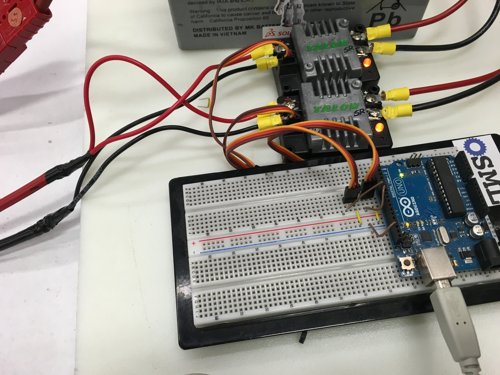

> SRTester is an Arduino program to easily test motors using Cross The Road Electronic's Talon SR motor controller. 

My robotics team often needs to test subsystem prototypes with a motor operating at less than 12 volts. People come to me and ask for the entire control system in order to just control one motor. This was a bit of a pain because 1) It's a lot of equipment to move around and configure 2) It always took the electronics away from me right when I was in the middle of something and 3) It required me to stand around and program or otherwise control the test.  

I figured the only thing we really need is a motor controller and a pwm signal, and taking the whole system around is overkill. 

So, I made this Arduino sketch. Simply type in a percent into the serial connection, and it will output the signal to the pins you select in the code. 

# Using
1. Download the zip of this repository and load the .ino file into the Arduino IDE
2. Change the `pins` array to the pins numbers you'd like to use as your PWM signal. You can choose as many output pins as you like (even the analog ones). 
3. (optional) You can change the initial `percent` variable to whatever you'd like the Arduino to start outputting when it starts. You can use this instead of setting values using a serial connection (headless mode). 
4. Connect and upload!
5. Open the Arduino's serial connection in a serial monitor at 9600 baud. Follow the directions on the screen!

## Wiring
Wiring is dead simple. You only need to connect the PWM ground pin to the Arduino ground, and the signal pin to the corresponding digital out pins (set in the programming). You don't even need to connect the 5v pin!  It doesn't do anything inside the Talon.

Of course, then you'll have to hook up your Talons to a battery.  Alligator clips will do, but a nice solder and crimp job will be appreciated.

Here's an example of what we did (click to see more detail):

## Other Notes
The original Talon and the Talon SRX will probably work also, although I haven't tested them.  Other motor controllers won't work by default, but you can easily modify the code to support them. 

This code is released under GPLv3, so fork away!
